# Отчет по проекту: UNIX/Linux Базовый

## Part 1. Установка ОС

**Задача:** Установить Ubuntu 20.04 Server LTS без графического интерфейса и проверить версию.

**Выполнение:**

- Создана виртуальная машина в VirtualBox
- Установлен Ubuntu 20.04 Server LTS без графического интерфейса
- Проверка версии системы: `cat /etc/issue`

**Результат:**

**Проверка отсутствия графического интерфейса:**
```bash
# Выполнены команды проверки дисплей менеджеров и X сервера: 
ps aux | grep -i gdm && ps aux | grep -i lightdm && ps aux | grep -i xorg`
```
- Результат: процессы `gdm`, `lightdm`, `xorg` отсутствуют в системе
- Подтверждена установка в режиме **только текстовой консоли**
  - ps aux | grep -i gdm      # Дисплей менеджер не запущен
  - ps aux | grep -i lightdm  # Альтернативный менеджер не запущен  
  - ps aux | grep -i xorg     # X сервер не запущен

**Проверка наличия графического интерфейса**

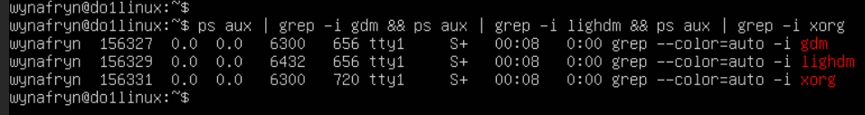

**Проверка версии системы**

```bash
# Проверка версии системы:
cat /etc/issue
```
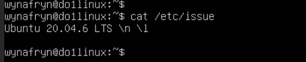

**Вывод:** Установлена Ubuntu 20.04.6 LTS без графического интерфейса.

## Part 2. Создание пользователя

**Задача:** Создать пользователя, отличного от созданного при установке, и добавить его в группу `adm`.

**Выполнение:**
```bash
# Создание пользователя:
sudo adduser do1-new_user

# Добавление в группу adm
sudo usermod -aG adm do1-new_user

# Проверка нового пользователя: 
cat /etc/passwd | grep do1-new_user
```

Пояснение использованных команд и ключей:
- `adduser` - интерактивная утилита создания пользователей (автоматически создает домашнюю директорию, устанавливает пароль)
- `usermod` - утилита модификации учетных записей пользователей
- `-aG` - ключи команды usermod:
  - `-a` (append) - добавить пользователя к дополнительным группам без удаления из текущих
  - `-G` (groups) - указать список дополнительных групп
- `adm` - группа, предоставляющая доступ к чтению системных логов

**Результаты:**

**Создание пользователя**

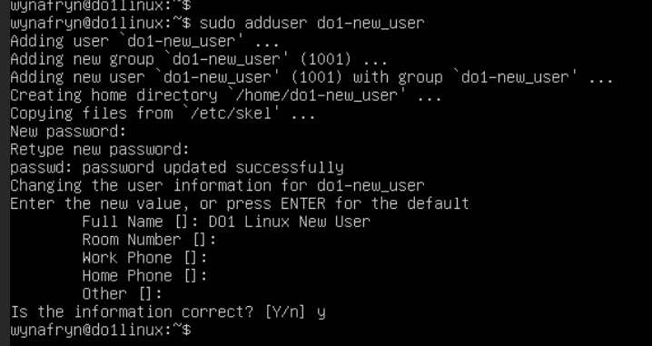

**Добавление в группу `adm` и проверка `/etc/passwd` по конретному пользователю**

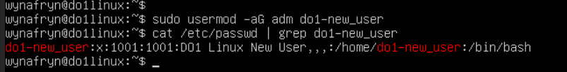

**Полный вывод `/etc/passwd`**

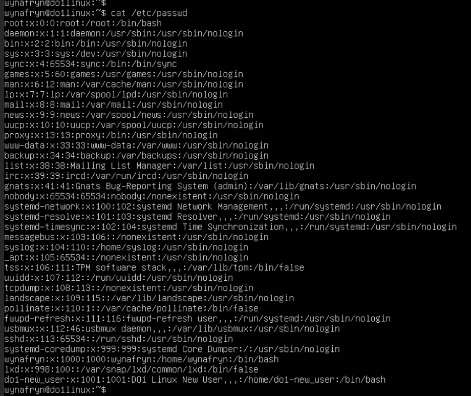

**Вывод:** Пользователь `do1-new_user` успешно создан и добавлен в группу `adm`.

## Part 3. Настройка сети ОС

**Задача:** Настройка сети, включая hostname, временную зону, сетевые интерфейсы и статические настройки.

**Выполнение:**

```bash
# Установка hostname: 
sudo hostnamectl set-hostname user-1

# Установка временной зоны:
sudo timedatectl set-timezone Europe/Moscow

# Просмотр сетевых интерфейсов: 
ip link show

#Получение IP от DHCP:
sudo dhclient
ip addr show

#Определение шлюза: 
ip route show
```
**Настройка статических параметров через netplan**

```bash
#Тестирование подключения: 
ping -c 4 1.1.1.1 
ping -c 4 ya.ru
```

**Результаты:**

**Установка имени хоста и временной зоны, перезапуск shell**

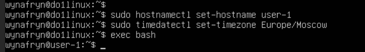

**Просмотр сетевых интерфейсов**
- lo: `state UNKNOWN` - нормально для loopback
- ens18: `state UP` - интерфейс активен и готов к работе
- Оба интерфейса в состоянии `UP, LOWER_UP` - корректно работают

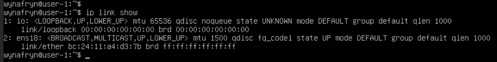

>Интерфейс **lo (loopback)** - виртуальный сетевой интерфейс для локальной коммуникации внутри системы.<br>
>Используется для тестирования сетевых приложений без реального сетевого подключения.<br>
>Имеет фиксированный IP-адрес 127.0.0.1

**Получени адреса от DHCP**

```bash
sudo dhclient -r ens18  # Освобождение текущего IP
sudo dhclient -v ens18  # Получение нового IP с подробным выводом
ip addr show            # Проверка результата
```

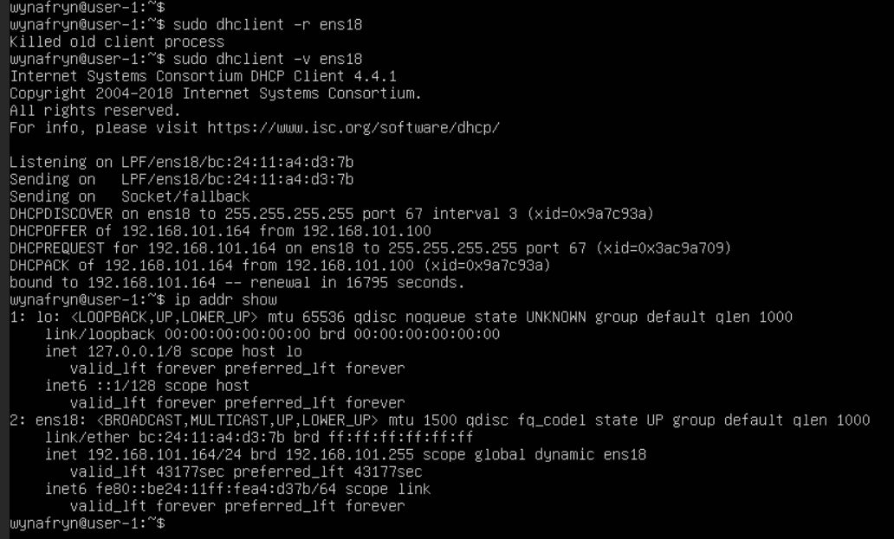

>**DHCP (Dynamic Host Configuration Protocol)** - протокол динамической конфигурации узлов.<br>
>Автоматически назначает IP-адреса и сетевые параметры (шлюз, DNS-серверы).<br>
>Позволяет подключать устройства к сети без ручной настройки

```
Расшифровка DHCP:
Процесс работы:
DISCOVER - клиент ищет DHCP сервер
OFFER - сервер предлагает IP адрес
REQUEST - клиент запрашивает предложенный IP
ACK - сервер подтверждает выделение IP
Результат:
Успешно получен IP: 192.168.101.164/24 от DHCP сервера 192.168.101.100
Статус: dynamic - подтверждает получение от DHCP
Аренда: 43177 секунд (~12 часов)
Получен IP: 192.168.101.164/24
```
**Определение шлюза**

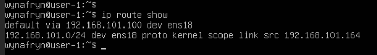

- Маршрут по умолчанию: `default via 192.168.101.100 dev ens18` через интерфейс ens18
- Локальная сеть: `192.168.101.0/24` с исходным адресом `src 192.168.101.164`
- Внешний IP шлюза: 192.168.101.100
- Внутренний IP шлюза: 192.168.101.164

**Задание сетевых настроек в ручную**
```bash
# Редактирование конфигурации netplan
sudo nano /etc/netplan/00-installer-config.yaml
```
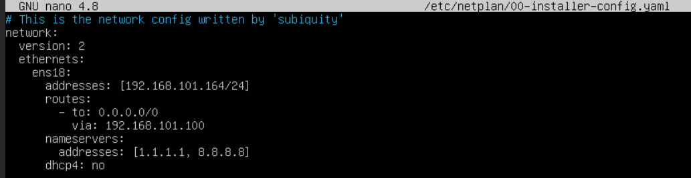

```bash
# Проверить синтаксис конфигурации и принять
sudo netplan try

# Применить настройки
sudo netplan apply

# Проверить результат
ip addr show
ip route show
systemd-resolve --status | grep 'DNS Servers'
```
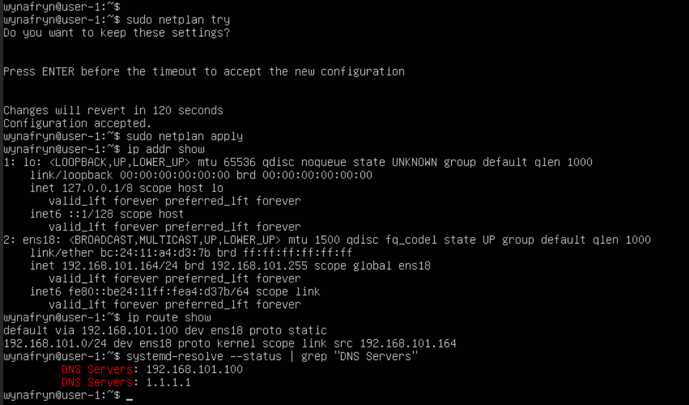

**Результат статических настроек:**

- Статический IP: 192.168.101.164/24 (scope global ens18 - без dynamic)
- Статический шлюз: 192.168.101.100 (proto static)
- DNS серверы: 1.1.1.1 (Cloudflare) и 192.168.101.100 (локальный)
- Подтверждение: Отсутствие DHCP-аренды, бессрочное время жизни IP

**Тестирование подключения**

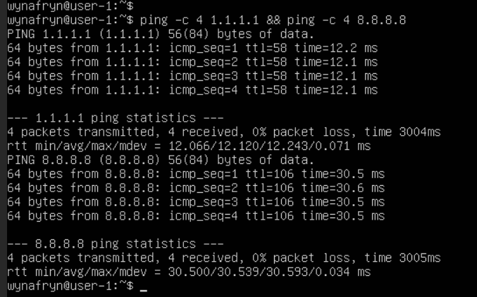

**Вывод:** Сеть настроена корректно, все тесты подключения успешны (0% packet loss).

## Part 4. Обновление ОС

**Задача:** Обновить системные пакеты до последней версии.

**Выполнение:**
```bash
# Обновление списка пакетов:
sudo apt update

# Обновление пакетов:
sudo apt upgrade -y

# Проверка отсутствия обновлений:
sudo apt update
```

**Результат:**
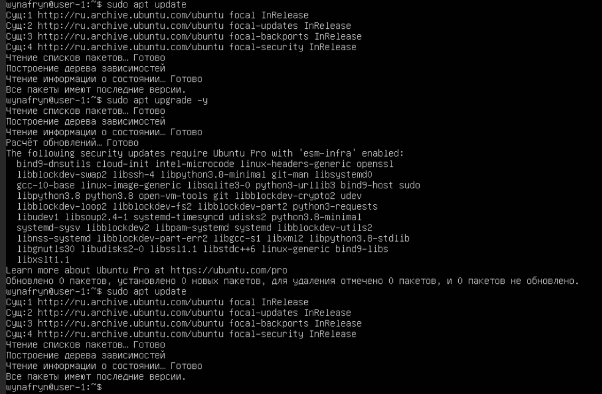

**Вывод:** Система полностью обновлена. Все пакеты имеют последние версии.

## Part 5. Использование команды sudo

**Задача:** Разрешить пользователю выполнять команду sudo и изменить hostname.

**Выполнение:**
```bash
# Добавление пользователя в группу sudo:
sudo usermod -aG sudo do1-new_user
# Смена hostname: 
sudo hostnamectl set-hostname user-1-changed
hostnamectl

# Перезапуст shell:
exec bash
```

**Результат:**

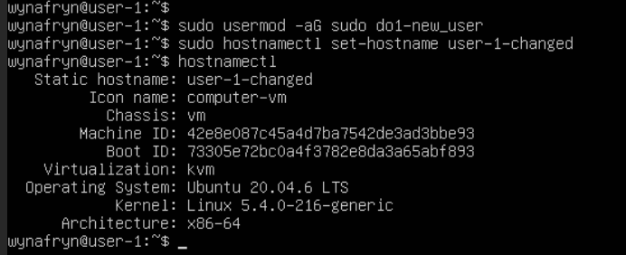

- Пользователю `do1-new_user` разрешено выполнять команды sudo
- Hostname изменен на `user-1-changed` с использованием sudo

>**Назначение команды sudo:**
>- **sudo (SuperUser DO)** - программа для предоставления временных привилегий суперпользователя
>- Позволяет authorized пользователям выполнять команды от имени root
>- Обеспечивает аудит и контроль доступа через конфигурационный файл `/etc/sudoers`
>- Основная цель - разделение привилегий и безопасность системы

**Вывод:** Hostname успешно изменен на "user-1-changed" с использованием sudo.

## Part 6. Установка и настройка службы времени

**Задача:** Настроить автоматическую синхронизацию времени и проверить корректность работы.

**Выполнение:**

- Включение NTP: 
```bash
sudo timedatectl set-ntp true
```
- Проверка:
```bash
timedatectl
timedatectl show
```
**Результаты:**

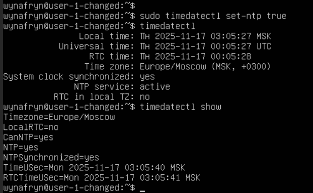

- Время и часовой пояс: `2025-11-17 03:05:27 MSK (Europe/Moscow)`
- NTP синхронизация: `NTPSynchronized=yes` - требование выполнено
- Служба времени: активна и синхронизирована
- Системное время: синхронизировано с NTP серверами

**Вывод:** Служба автоматической синхронизации времени настроена корректно.

## Part 7. Установка и использование текстовых редакторов

**Задача:** Установить VIM и два дополнительных редактора, протестировать основные операции.

**Выполнение:**
```bash
# Установка:
sudo apt install vim nano mcedit -y
```
- Тестирование операций в каждом редакторе

### VIM операции:

- Создание файла: `vim test_VIM.txt`
- Выход с сохранением: `Esc → :wq → Enter`
- Выход без сохранения: `Esc → :q! → Enter`
- Поиск: `/слово → Enter`
- Замена: `:%s/старое/новое/g → Enter`


### NANO операции:

- Создание файла: `nano test_NANO.txt`
- Выход с сохранением: `Ctrl+X → Y → Enter`
- Выход без сохранения: `Ctrl+X → N`
- Поиск: `Ctrl+W`
- Замена: `Ctrl+\ → ввод слова → Tab → ввод замены → A (все)`

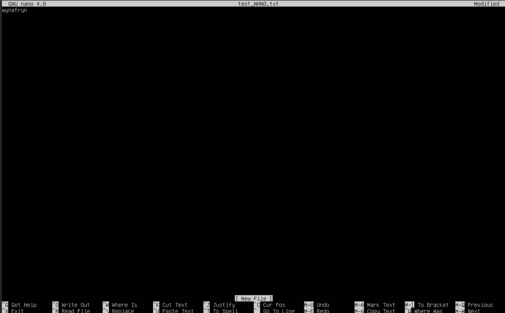
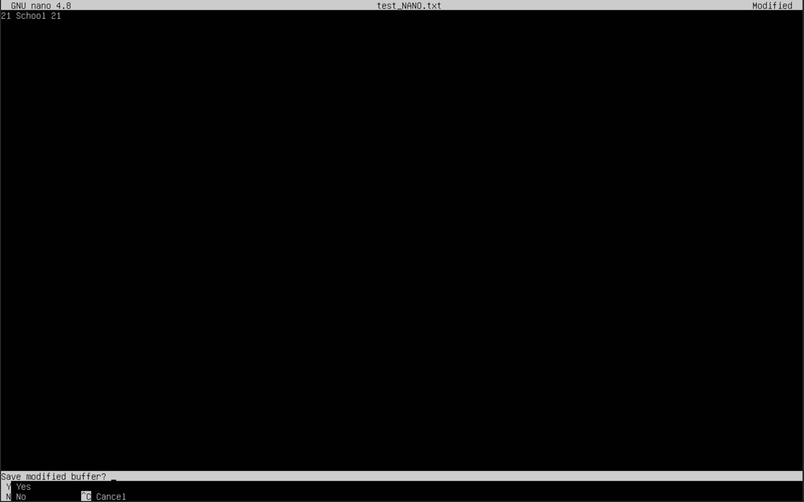
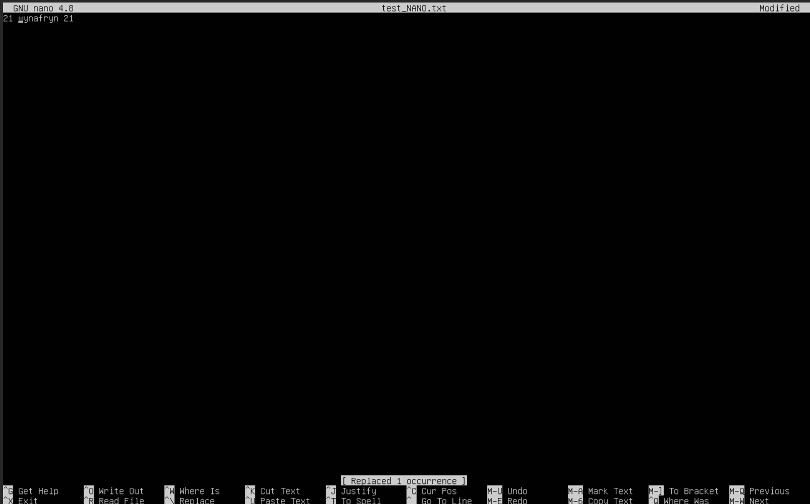

### MCEDIT операции:

- Создание файла: `mcedit test_MCEDIT.txt`
- Выход с сохранением: `F2 → Enter → F10`
- Выход без сохранения: `F10 → No`
- Поиск: `F7`
- Замена: `F4 → ввод слова → Tab → ввод замены → Заменить/Все`

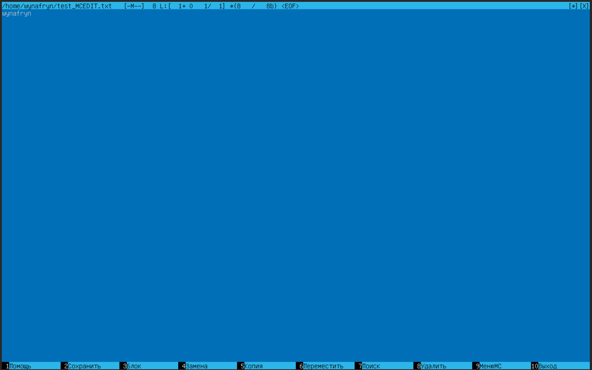
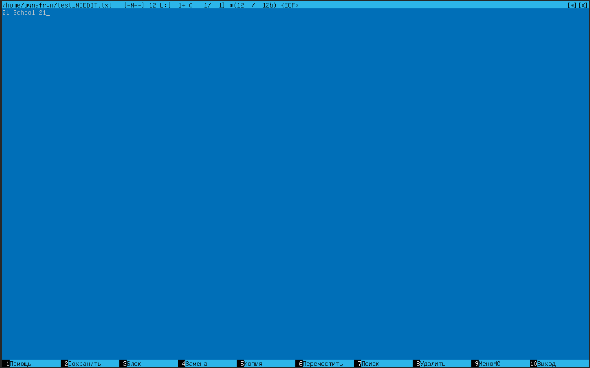
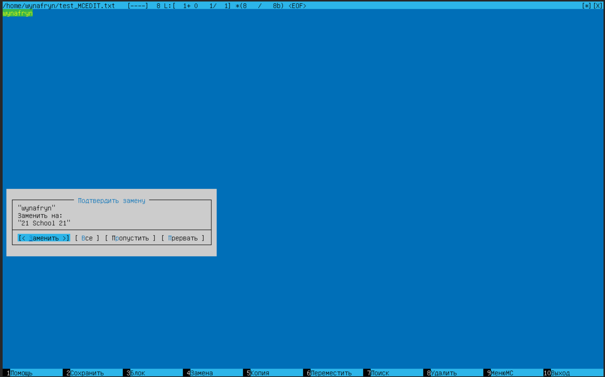

**Вывод:** Все три текстовых редактора успешно протестированы.

## Part 8. Установка и базовая настройка сервиса SSHD

**Задача:** Установить SSH сервер, настроить на порт 2022 и проверить работу.

**Выполнение:**
```bash
# Установка:
sudo apt install openssh-server -y
```
Настройка порта в `/etc/ssh/sshd_config`: `Port 2022`
```bash
# Включение автозапуска:
sudo systemctl enable ssh

#Перезапуск:
sudo systemctl restart ssh

# Проверка:
ps aux | grep sshd
sudo netstat -tan`
```
**Результаты:**

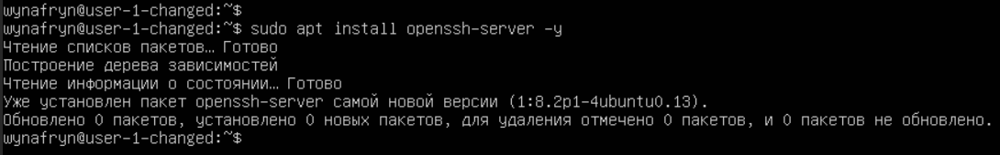
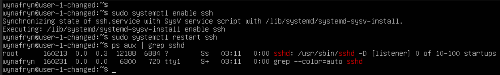

**Команда `ps aux | grep sshd`:**

- `ps` - показывает запущенные процессы
- `aux` - ключи: `a` (все процессы), `u` (пользовательский формат), `x` (процессы без терминала)

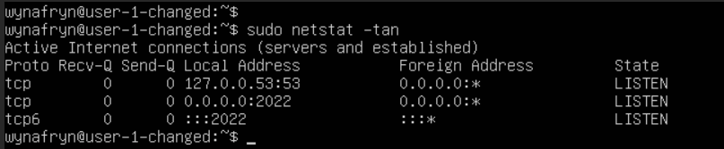

>**Команда `netstat -tan`:**
- -t - отображать только TCP соединения
- -a - показать все соединения (и прослушивающие, и установленные)
- -n - выводить адреса и порты в числовом формате (без разрешения имен)

**Столбцы:**
- Proto - протокол (tcp/tcp6)
- Recv-Q - количество байт, не скопированных программой пользователя
- Send-Q - количество байт, не подтвержденных удаленным хостом
- Local Address - локальный адрес и порт
- Foreign Address - удаленный адрес и порт
- State - состояние соединения

LISTEN - состояние ожидания входящих подключений
-  `tcp 0 0 0.0.0.0:2022 0.0.0.0:* LISTEN` ✓
- `0.0.0.0:2022` - служба слушает на всех интерфейсах порт 2022

**Вывод:** SSH сервер успешно установлен и работает на порту 2022.

## Part 9. Установка и использование утилит top, htop

**Задача:** Установить и проанализировать систему через top и htop.

**Выполнение:**
```bash
# Установка:
sudo apt install htop -y
```
- Анализ через top
- Настройка htop с сортировкой и фильтрацией

**Результаты:**

**Общий обзор системы через команду top**
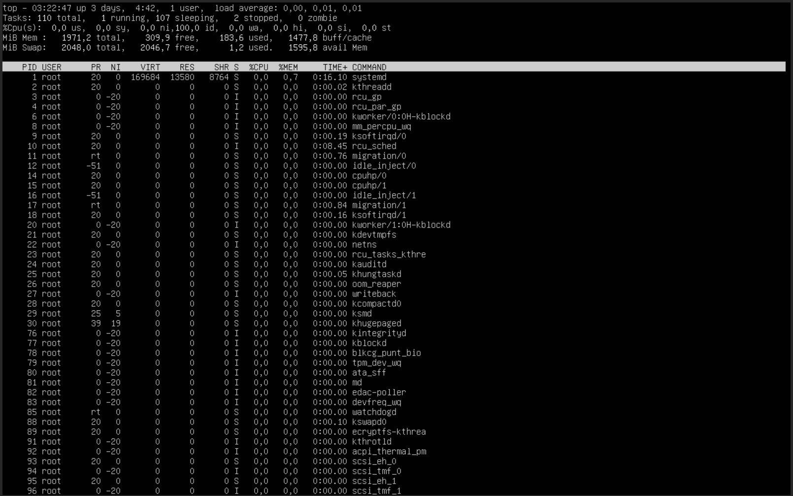

```bash
# Процессы с максимальной памятью
ps aux --sort=-%mem | head -5

# Процессы с максимальным CPU
ps aux --sort=-%cpu | head -5
```
**Определение процессов с максимальным использованием ресурсов:**
- PID 135476: 1.8% памяти - snapd
- PID 157693: 1.4% памяти - fwupd
- PID 135185: 1.4% памяти - systemd-journald
- PID 733: 1.0% памяти - unattended-upgrades

2. Процессы с максимальным CPU:
- PID 1: 0.0% CPU - systemd
- PID 2: 0.0% CPU - kthreadd
- PID 3: 0.0% CPU - rcu_gp
- PID 4: 0.0% CPU - rcu_par_gp

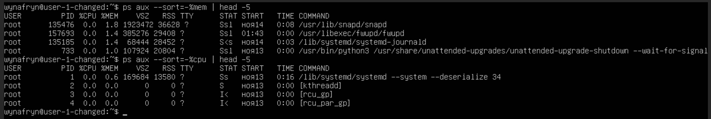


**Сортировка процессов по PID (идентификатору процесса) в порядке возрастания**

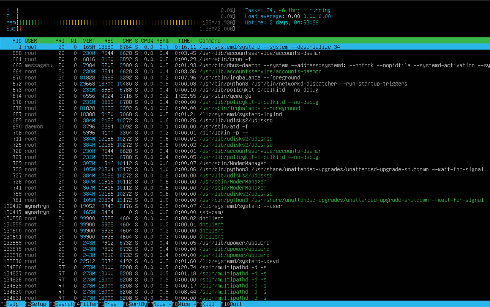

**Сортировка процессов по PERCENT_CPU (процент использования процессора) в порядке убывания**

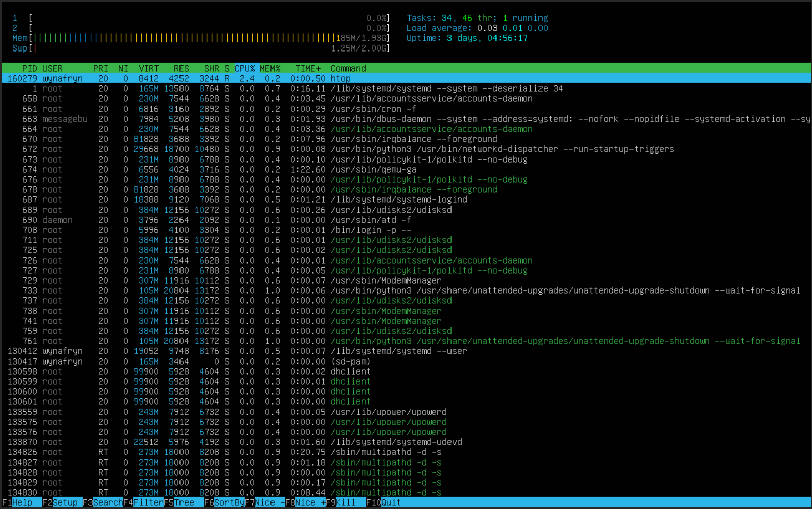

**Сортировка процессов по PERCENT_MEM (процент использования памяти) в порядке убывания**

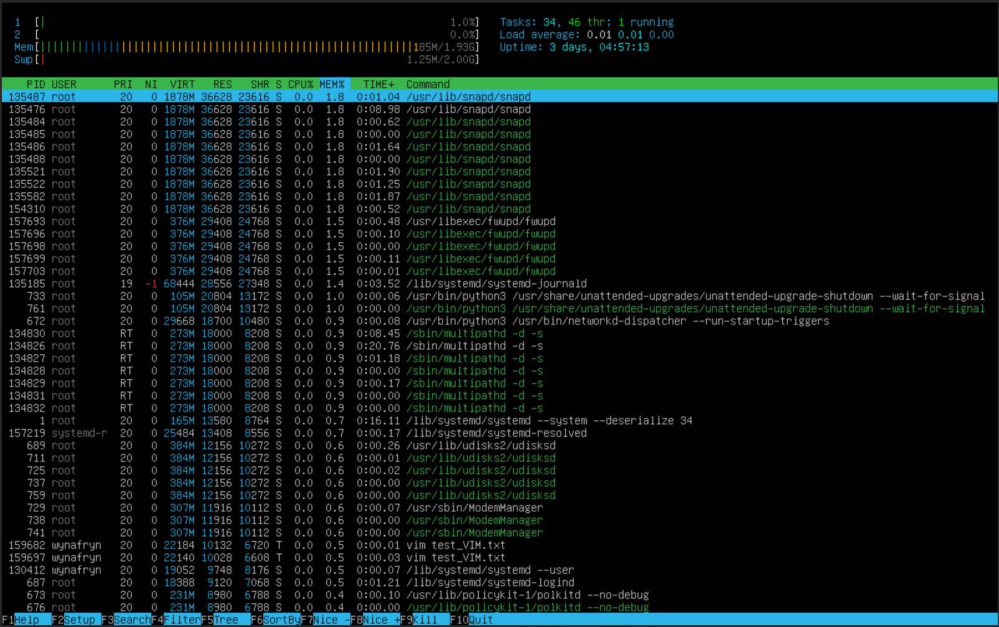

**Сортировка процессов по TIME (времени выполнения) в порядке убывания**

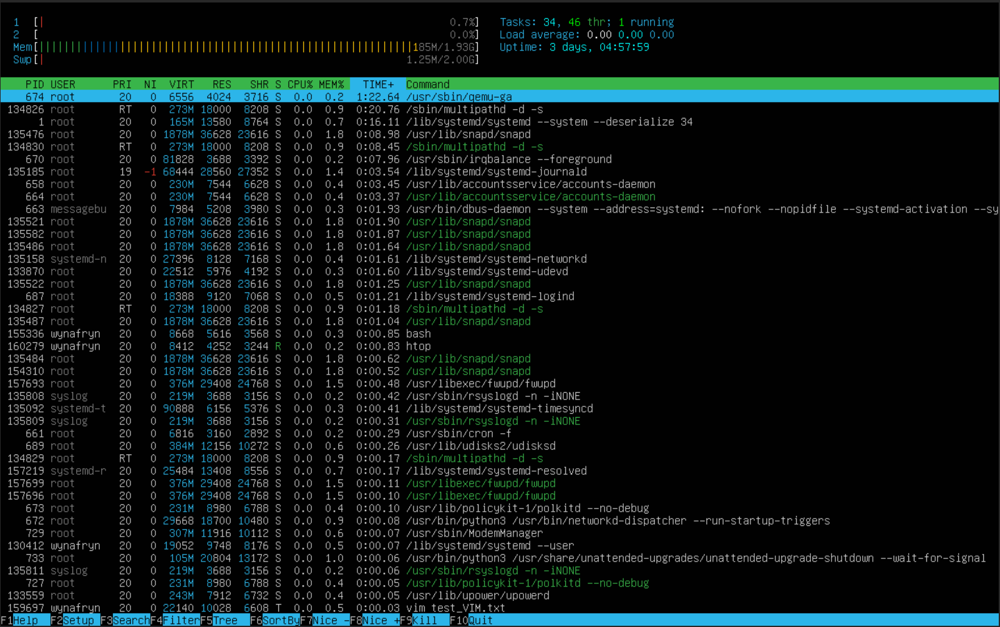

**Фильтрация процессов для отображения только sshd**

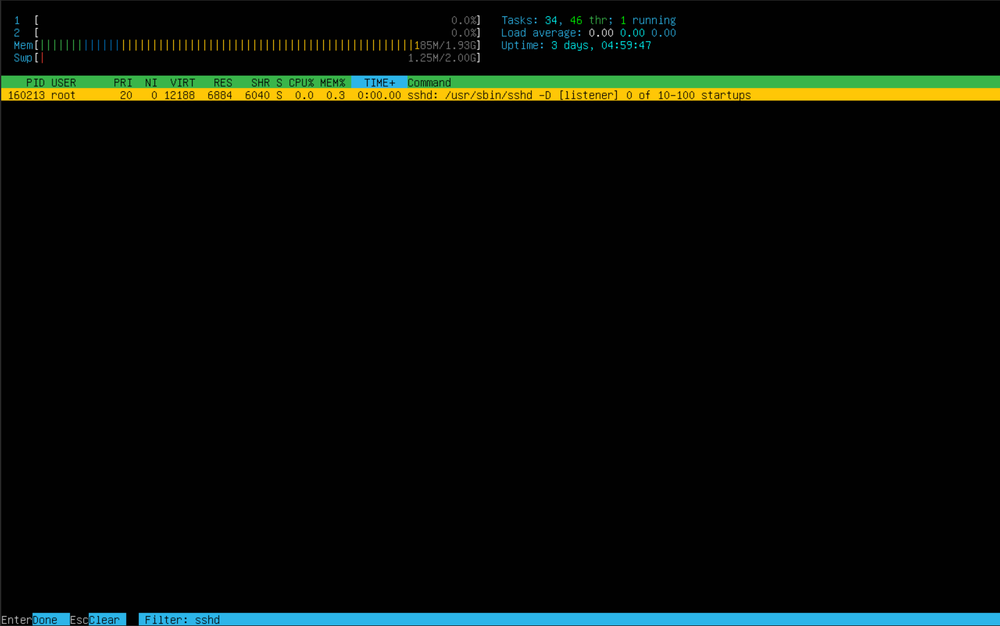

**Поиск процесса syslog с использованием функции поиска htop**
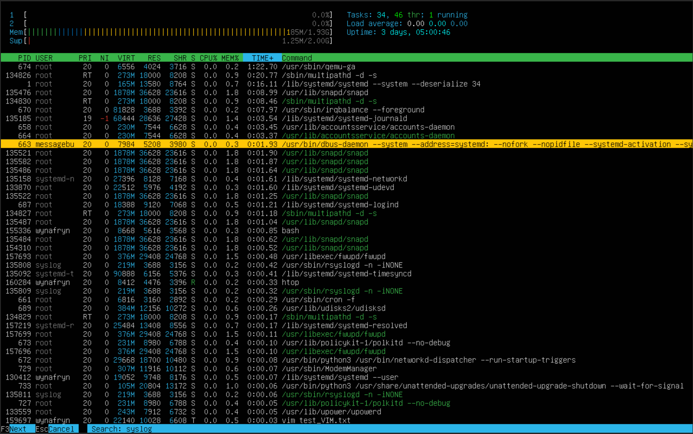

**Вывод:** Утилиты top и htop установлены и протестированы. Выполнена сортировка процессов по PID, PERCENT_CPU, PERCENT_MEM, TIME. Процесс sshd отфильтрован, процесс syslog найден через поиск. В вывод добавлены hostname, clock и uptime.

## Part 10. Использование утилиты fdisk

**Задача:** Проанализировать информацию о жестком диске через fdisk.

**Выполнение:**

```bash
sudo fdisk -l
```

**Результат:**
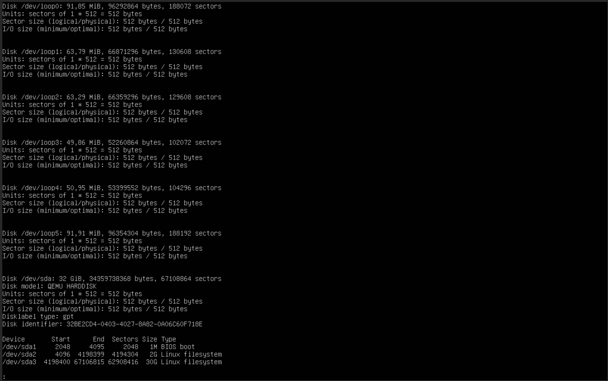
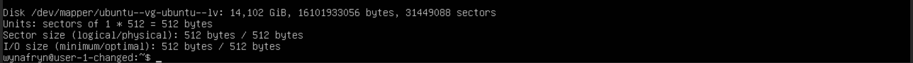

**Результаты:**

- Жесткий диск: /dev/sda
- Размер диска: 32 GB (34,393,738,368 bytes)
- Количество секторов: 67,108,864
- Модель: QEMU HARDDISK (виртуальный диск)
- Таблица разделов: GPT

Разделы:
- /dev/sda1: 1M (BIOS boot)
- /dev/sda2: 2G (Linux filesystem)
- /dev/sda3: 30G (Linux filesystem)

**Swap информация:** В выводе не отображается отдельный swap раздел, используется swap-файл или swap в LVM

**Вывод:** Проанализирована структура диска: основной диск 32GB с GPT разметкой, три раздела и LVM логический том 14GB.

## Part 11. Использование утилиты df

**Задача:** Проанализировать дисковое пространство через df.

**Выполнение:**

```bash
df
df -Th
```

**Результаты:**
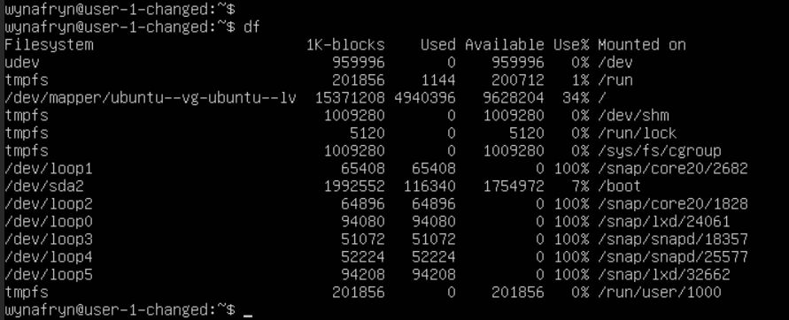

**Анализ для корневого раздела (/):**

- **Размер раздела:** 15,371,208 блоков (1K-блоки)
- **Занятое пространство:** 4,939,788 блоков
- **Свободное пространство:** 9,628,812 блоков
- **Процент использования:** 34%
- **Единица измерения:** 1K-блоки (килобайты)

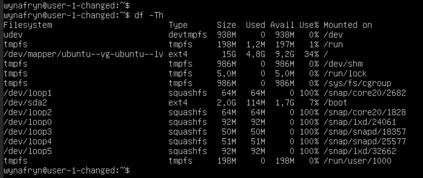

**Анализ для корневого раздела (/):**

- **Размер раздела:** 15G
- **Занятое пространство:** 4.8G
- **Свободное пространство:** 9.2G
- **Процент использования:** 34%
- **Тип файловой системы:** ext4

**Вывод:** Дисковое пространство проанализировано.

## Part 12. Использование утилиты du

**Задача:** Проанализировать размер папок через du.

**Выполнение:**

```bash
du -h /home
du -h /var | head -30 # вывод первых 30 строк
du -h /var/log
du -h /var/log/*
```

**Результаты:**

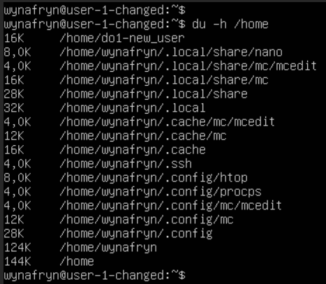

**/home:** 144K

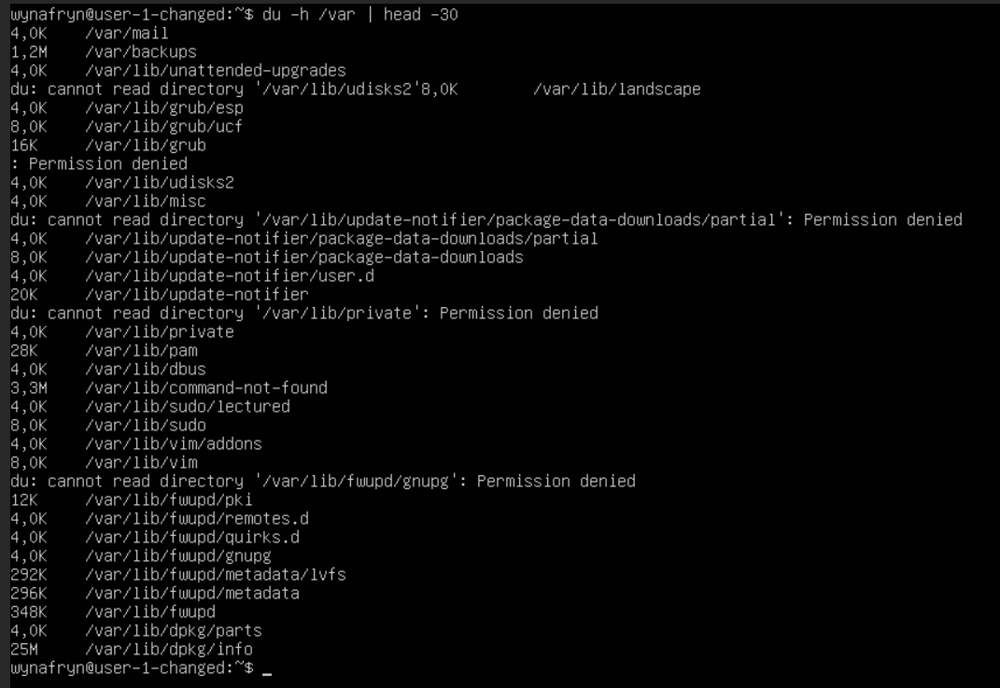

**/var:** частичный вывод, первые 30 строк

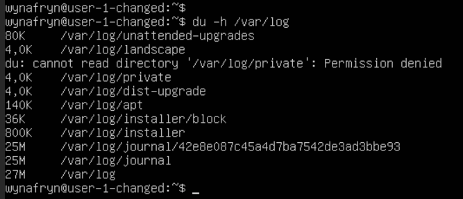

**/var/log:** 27M (основной объем в journal - 25M)

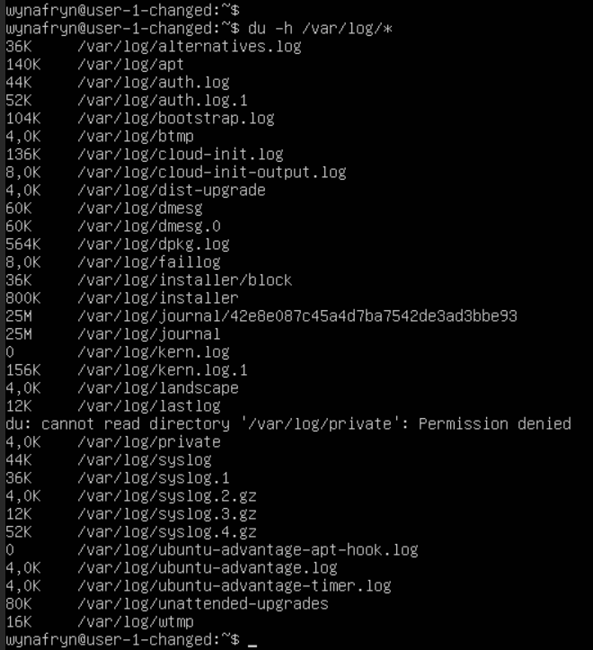

**/var/log/***: детальный размер всех файлов

**Вывод:** Размеры папок проанализированы.

## Part 13. Установка и использование утилиты ncdu

**Задача:** Установить и использовать ncdu для анализа дискового пространства.

**Выполнение:**

```bash
# Установка ncdu
sudo apt install ncdu -y

ncdu /home
ncdu /var
ncdu /var/log
```

**Результаты:**
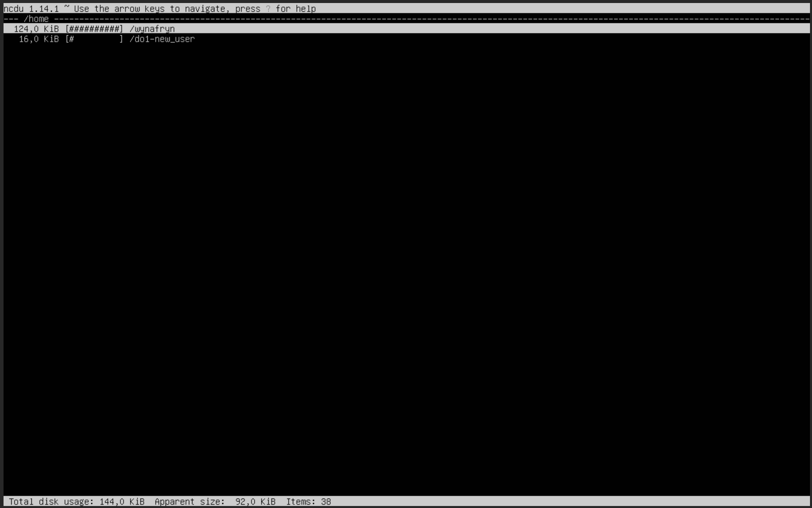
**/home:** 144.0 KiB

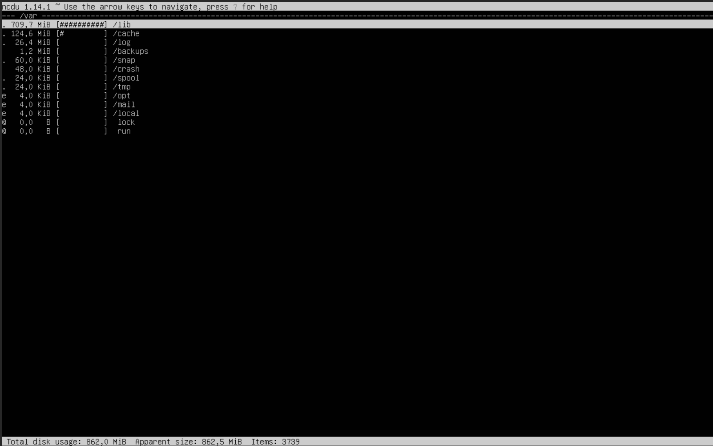
**/var:** 862.5 MiB

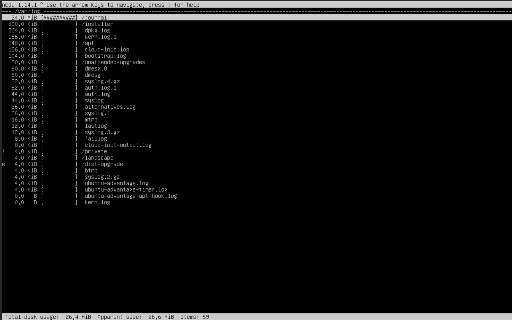
**/var/log:** 26.6 MiB

**Вывод:** ncdu установлен и успешно протестирован.

## Part 14. Работа с системными журналами

**Задача:** Анализ системных журналов и перезапуск службы SSH.

**Выполнение:**

```bash
sudo tail -20 /var/log/auth.log
sudo tail -20 /var/log/syslog
sudo systemctl restart ssh
sudo grep "sshd" /var/log/auth.log | tail -5
```

**Результаты:**

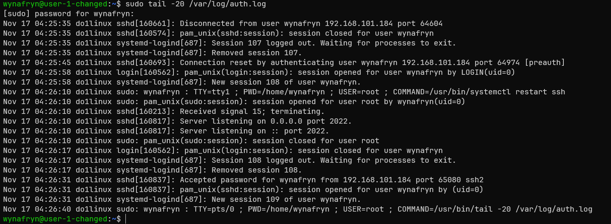

- Время последней успешной авторизации: `17 ноября 04:26:31`
- Имя пользователя: `wynafryn`
- Метод входа: SSH (ssh2) с IP `192.168.101.184`
- Сообщения о рестарте службы SSH:
- `Received signal 15; terminating.` - остановка SSH демона
- `Server listening on 0.0.0.0 port 2022.` - успешный запуск на порту 2022
- `Server listening on :: port 2022.` - запуск для IPv6

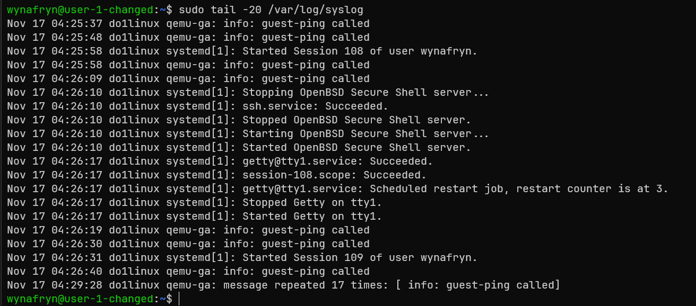

**Подтверждение рестарта SSH через systemd:**

- `Stopping OpenBSD Secure Shell server...` - начало остановки
- `ssh.service: Succeeded` - успешное завершение
- `Stopped OpenBSD Secure Shell server` - служба остановлена
- `Starting OpenBSD Secure Shell server...` - начало запуска
- `Started OpenBSD Secure Shell server` - служба запущена

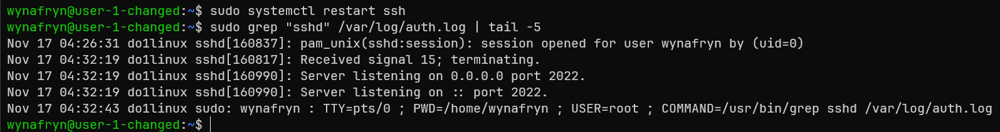

**Четкие доказательства перезапуска SSH:**
- `sudo systemctl restart ssh` - команда выполнена
- `Received signal 15; terminating.` - остановка SSH демона
- `Server listening on 0.0.0.0 port 2022.` - запуск на порту 2022
- `Server listening on :: port 2022.` - запуск для IPv6

**Временные метки:**
- Рестарт выполнен в `04:32:19`
- Подтверждение работы на порту `2022`

**Вывод:** Системные журналы проанализированы. Служба SSH успешно перезапущена.

## Part 15. Использование планировщика заданий CRON

**Задача:** Настройка задания uptime через cron и проверка выполнения.

**Выполнение:**

```bash
# Добавление задания:
crontab -e # добавить задание */2 * * * * uptime

# Проверка выполнения: 
sudo grep CRON /var/log/syslog

# Просмотр заданий:
crontab -l

# Удаление заданий:
crontab -r
```
**Результаты:**

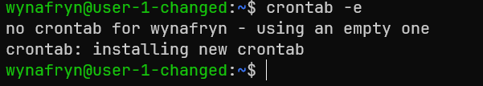

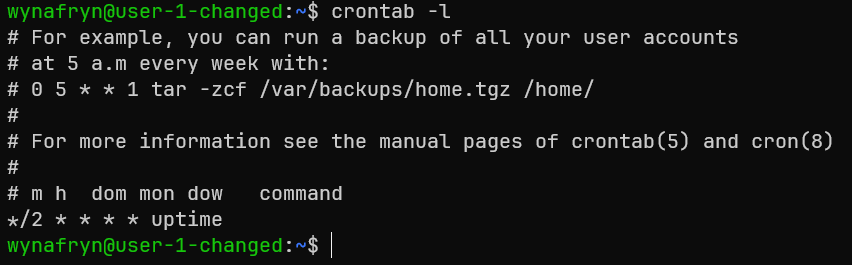
**Текущее задание:**

- */2 * * * * uptime - выполнение команды uptime каждые 2 минуты

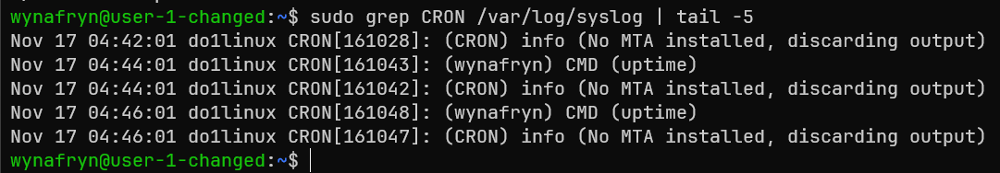
**Записи о выполнении: - Минимум две записи в заданном временном диапазоне ✓**

- `Nov 17 04:44:01 dollinux CRON[161043]: (wynafryn) CMD (uptime)`
- `Nov 17 04:46:01 dollinux CRON[161048]: (wynafryn) CMD (uptime)`


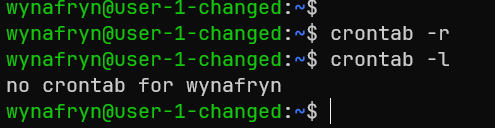

**Результат:** `no crontab for wynafryn`

**Вывод:** Планировщик cron настроен и протестирован.
